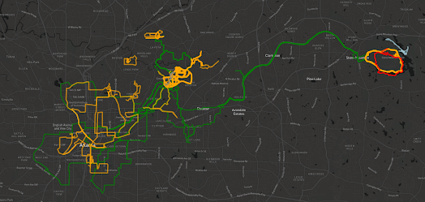
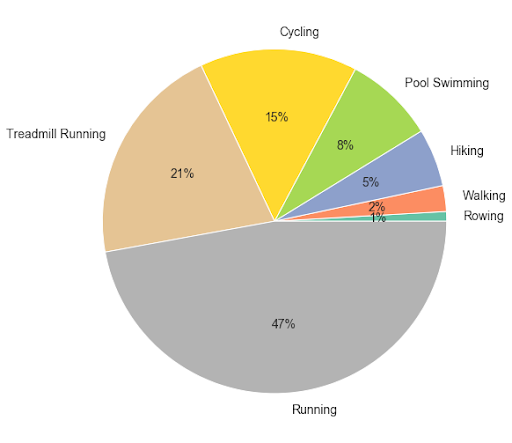
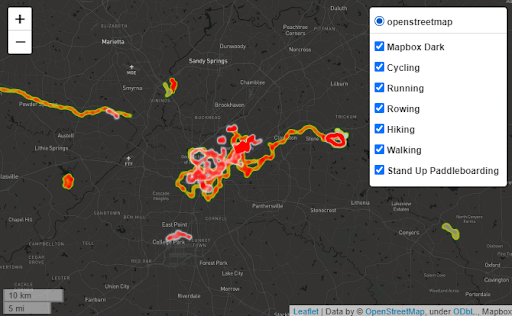

Visualization of activities from Garmin Connect
============================ 

This project contains code for processing activities with gpx-files from Garmin Connect.  To export activities from Garmin Connect use gcexport.py  from this repo: [garmin-connect-export](https://github.com/pe-st/garmin-connect-export).

The jupyter notebook contains code for data processing and analysis. It includes data import and parsing, as well as visualization like charts, histograms, geographical maps, and heatmaps. 

Pie chart of activities types

Heatmap of gps activities 

I wrote medium article about this project: [My article](https://medium.com/@azholud/analysis-and-visualization-of-activities-from-garmin-connect-b3e021c62472)
